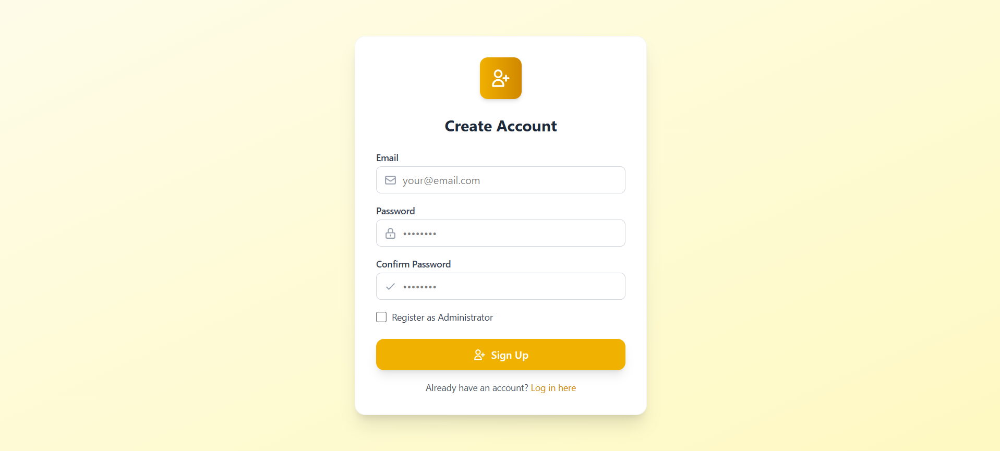

# ORU Phones E-Commerce & Analytics Platform

## Overview

This project is a full-stack e-commerce web application for tracking User Interaction on web page, built as part of an assignment. It features:

- **User and Admin Authentication**
- **Web Pages to capture User Interaction**
- **User Activity Tracking & Analytics**
- **Admin Dashboard with Visual Reports**
- **Modern UI with Responsive Design**

The project is divided into two main parts:
- **Frontend:** Built with Next.js (in `/e-commerce-app`)
- **Backend:** Built with Node.js, Express, MongoDB, and Redis (in `/server`)

---

## Architecture of Project

```mermaid
flowchart TB
    %% Increased font size and vertical layout
    classDef default font-size:16px

    %% Main vertical flow
    Client["📱 Client"] --> Browser["🌐 Browser"]
    Browser --> NextjsApp["⚛️ Next.js App"]
    
    NextjsApp --> FrontendPages
    NextjsApp --> Nodejs["🟢 Node.js (API Server)"]
    
    Nodejs --> UserRouter["🟡 UserRouter"]
    Nodejs --> AdminRouter["🟠 AdminRouter"]
    
    UserRouter --> Middleware["🛡️ Middleware"]
    AdminRouter --> Middleware
    
    Middleware --> Redis["⚡ Redis"]
    Middleware --> MongoDB["📦 MongoDB"]

    %% Vertical subgraph layout
    subgraph FrontendPages["Frontend Pages"]
        direction TB
        Home["🏠 Home"] --> BestDeals["🔥 BestDeals"]
        BestDeals --> AdminDashboard["⚙️ AdminDashboard"]
        AdminDashboard --> LoginPage["🔑 LoginPage"]
        LoginPage --> SignupPage["📝 SignupPage"]
        SignupPage --> ProductPage["📱 ProductPage"]
    end

    subgraph UserEndpoints["User Endpoints"]
        direction TB
        UE1["<b>POST</b> <span style='padding:6px 18px;border-radius:12px;'>/user/create</span>"]
        UE2["<b>POST</b> <span style='padding:6px 18px;border-radius:12px;'>/user/login</span>"]
        UE3["<b>GET</b> <span style='padding:6px 18px;border-radius:12px;'>/user/logout</span>"]
        UE4["<b>GET</b> <span style='padding:6px 18px;border-radius:12px;'>/user/role</span>"]
        UE5["<b>GET</b> <span style='padding:6px 18px;border-radius:12px;'>/user/report/user-login</span>"]
        UE6["<b>GET</b> <span style='padding:6px 18px;border-radius:12px;'>/user/track-visitor</span>"]
        UE7["<b>POST</b> <span style='padding:6px 18px;border-radius:12px;'>/user/track-interaction</span>"]
    end

    subgraph AdminEndpoints["Admin Endpoints"]
        direction TB
        AE1["<b>POST</b> <span style='padding:6px 18px;border-radius:12px;'>/admin/create</span>"]
        AE2["<b>POST</b> <span style='padding:6px 18px;border-radius:12px;'>/admin/login</span>"]
        AE3["<b>GET</b> <span style='padding:6px 18px;border-radius:12px;'>/admin/role</span>"]
        AE4["<b>GET</b> <span style='padding:6px 18px;border-radius:12px;'>/admin/logout</span>"]
        AE5["<b>GET</b> <span style='padding:6px 18px;border-radius:12px;'>/admin/report</span>"]
        AE6["<b>GET</b> <span style='padding:6px 18px;border-radius:12px;'>/admin/report/url</span>"]
        AE7["<b>GET</b> <span style='padding:6px 18px;border-radius:12px;'>/admin/report/userId</span>"]
    end

    %% Vertical connections
    UserRouter --> UserEndpoints
    AdminRouter --> AdminEndpoints
    UserEndpoints --> UserController["👤 UserController"]
    AdminEndpoints --> AdminController["🛠️ AdminController"]
    UserController --> MongoDB
    AdminController --> MongoDB

    %% Preserved original styling
    style Client fill:#181c24,stroke:#00eaff,stroke-width:3px,rx:18,ry:18,filter:glow
    style Browser fill:#232946,stroke:#ffb800,stroke-width:3px,rx:18,ry:18,filter:glow
    style NextjsApp fill:#393e46,stroke:#00ffb7,stroke-width:3px,rx:18,ry:18,filter:glow
    style Nodejs fill:#22223b,stroke:#f72585,stroke-width:3px,rx:18,ry:18,filter:glow
    style UserRouter fill:#282a36,stroke:#ffb86c,stroke-width:3px,rx:18,ry:18,filter:glow
    style AdminRouter fill:#282a36,stroke:#ff5555,stroke-width:3px,rx:18,ry:18,filter:glow
    style Middleware fill:#1a1a2e,stroke:#00eaff,stroke-width:3px,rx:18,ry:18,filter:glow
    style UserController fill:#232946,stroke:#00ffb7,stroke-width:3px,rx:18,ry:18,filter:glow
    style AdminController fill:#232946,stroke:#ff5555,stroke-width:3px,rx:18,ry:18,filter:glow
    style MongoDB fill:#000fb7,stroke:#181c24,stroke-width:3px,rx:18,ry:18,filter:glow
    style Redis fill:#ff5555,stroke:#181c24,stroke-width:3px,rx:18,ry:18,filter:glow
    style FrontendPages fill:#232946,stroke:#00eaff,stroke-width:2px,rx:18,ry:18,filter:glow
    style UserEndpoints fill:#181c24,stroke:#00eaff,stroke-width:2px,rx:18,ry:18,filter:glow
    style AdminEndpoints fill:#181c24,stroke:#ff5555,stroke-width:2px,rx:18,ry:18,filter:glow

    click UserRouter call linkCallback("c:/Users/manis/Desktop/folder/code/assignment_ORU_phones/server/src/route/userRouter.ts")
    click AdminRouter call linkCallback("c:/Users/manis/Desktop/folder/code/assignment_ORU_phones/server/src/route/adminRouter.ts")
    click LoginPage call linkCallback("c:/Users/manis/Desktop/folder/code/assignment_ORU_phones/e-commerce-app/src/pages/login.tsx#L9")
    click SignupPage call linkCallback("c:/Users/manis/Desktop/folder/code/assignment_ORU_phones/e-commerce-app/src/pages/signup.tsx#L8")
```



---


## Table of Contents

- [Features](#features)
- [Project Structure](#project-structure)
- [Setup & Installation](#setup--installation)
- [Usage](#usage)
- [Assignment Requirements Mapping](#assignment-requirements-mapping)
- [Technical Stack](#technical-stack)
- [Screenshots](#screenshots)
- [Contributing](#contributing)
- [License](#license)

---

## Features

### User Side

- **User Sign Up / Login / Logout**
- **Browse Used Phones**
- **Browse Detailed Page For Each Product**
- **View Product Details**
- **Track User Interactions (page visits, button clicks, scroll, time spent, etc.)**

### Admin Side

- **Admin Sign Up / Login / Logout**
- **View Analytics Dashboard**
- **See Top Visited Pages, Top Filters, Top Buttons, Top Links, Top Users, Avg Time per Page**
- **User-wise and Page-wise Analytics**
- **Date Range Filtering for Reports**
- **Visualizations (Bar, Doughnut charts, etc.)**

### Tracking & Analytics

- **Tracks:**
  - Page visits
  - Button/link clicks
  - Scroll percentage
  - Time spent per page
  - Filter usage
  - User login/logout events
- **Stores analytics in MongoDB and Redis for fast access**

---

## Project Structure

```
assignment-oru-phones/
│
├── e-commerce-app/      # Frontend (Next.js, React, TailwindCSS)
│   ├── src/
│   │   ├── components/  # Reusable UI components (Header, Footer, etc.)
│   │   ├── pages/       # Next.js pages (login, signup, admin, index, etc.)
│   │   ├── context/     # React context for auth, user state
│   │   └── utility/     # Utility functions
│   └── public/          # Static assets
│
├── server/              # Backend (Node.js, Express, MongoDB, Redis)
│   ├── src/
│   │   ├── controller/  # Route controllers (user, admin, analytics)
│   │   ├── middleware/  # Auth, session, tracking middleware
│   │   ├── models/      # Mongoose models (User, Admin, Analytics, etc.)
│   │   ├── routes/      # Express routes (user, admin, analytics)
│   │   |── utils/       # Utility functions
|   |   |-- index.ts     # Entry Point                   
│   └── package.json     # Contains all packages
│
└── README.md            # Project documentation
```

---

## Setup & Installation

### Prerequisites

- Node.js (v18+ recommended)
- MongoDB (local or cloud)
- Redis (local or cloud)
- npm or yarn

### 1. Clone the Repository

```bash
git clone https://github.com/kumarmanishrai/assignment-oru-phones.git
cd assignment-oru-phones
```

### 2. Backend Setup

```bash
cd server
npm install
# Create a .env file (see server_example.env for reference)
npm run dev
```

- The backend will start on the port specified in `.env` (default: 5000).

### 3. Frontend Setup

```bash
cd ../e-commerce-app
npm install
# Create a .env.local file (see client_example.env for reference)
npm run dev
```

- The frontend will start on [http://localhost:3000](http://localhost:3000).

---

## Usage

- **User:** Sign up or log in to browse phones.
- **Admin:** Log in as admin to access the analytics dashboard.
- **Analytics:** All user interactions are tracked and visualized for the admin.

---

## Assignment Requirements Mapping

| Assignment Requirement                | Implementation Details                                                                 |
|----------------------------------------|---------------------------------------------------------------------------------------|
| User Authentication                   | `/e-commerce-app/src/pages/login.tsx`, `/server/src/controller/userController.ts`     |
| Admin Authentication                  | `/e-commerce-app/src/pages/login.tsx`, `/server/src/controller/adminController.ts`    |
| User Activity Tracking                | `/server/src/middleware/trackingMiddleware.ts`, `/controller/userController.ts`  |
| Analytics Dashboard                   | `/e-commerce-app/src/pages/admin.tsx` (charts, stats, filters, modals)                |
| Date Range Filtering                  | Admin dashboard date pickers, backend query params                                    |
| Visual Reports (Charts)               | Chart.js integration in `/e-commerce-app/src/pages/admin.tsx`                         |
| Session Management                    | Express-session, Redis, custom middleware                                             |
| Data Storage                          | MongoDB for persistent data, Redis for sessions and fast analytics                    |
| Responsive UI                         | TailwindCSS, responsive grid layouts                                                  |

---

## Technical Stack

- **Frontend:** Next.js, TailwindCSS, Chart.js
- **Backend:** Node.js, Express, MongoDB (Mongoose), Redis
- **Authentication:** Sessions (express-session, Redis store)
- **Tracking:** Custom middleware, MongoDB for analytics
- **Visualization:** Chart.js (Bar, Doughnut, etc.)

---

## Screenshots





---

## Contributing

Pull requests are welcome! For major changes, please open an issue first to discuss what you would like to change.

---

## License

This project is for educational purposes as part of an assignment.

---

## Contact

For any queries, contact [kumarmanishraiatwork@gmail.com](mailto:kumarmanishraiatwork@gmail.com).
